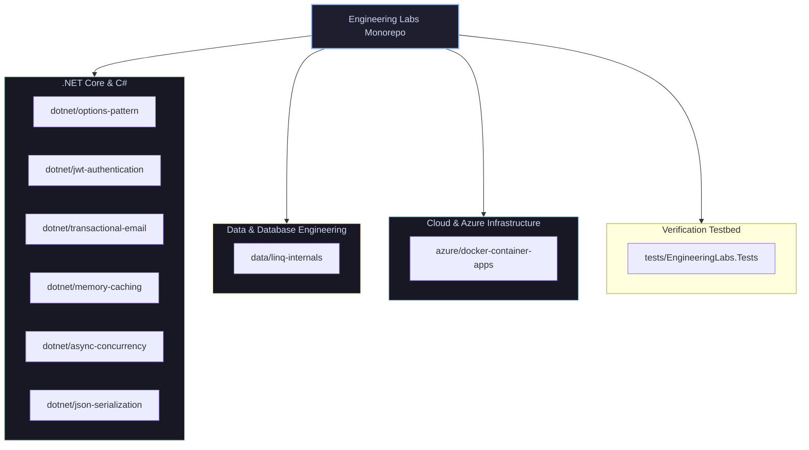

# Engineering Labs

[](https://github.com/kdmbhushan/engineering-labs/actions/workflows/ci.yml)
[](LICENSE)
[](https://dotnet.microsoft.com/)

> **Centralized laboratory repository housing reproducible experiments, failure injection testbeds, and production patterns across .NET, Data, and Azure.**

This repository anchors the technical engineering articles published on 🔗 **[bhushankadam.dev](https://bhushankadam.dev)**.

---

## 🏛️ Architecture & Monorepo Layout

The repository is organized into three architectural pillars (`dotnet/`, `data/`, `azure/`), supported by automated verification testbeds:



---

## 🔬 Laboratory Experiment Catalog

| Pillar | Experiment Directory | Core Technologies | Problem Solved | Companion Article |
| :--- | :--- | :--- | :--- | :--- |
| **.NET** | [`dotnet/options-pattern`](./dotnet/options-pattern) | `IOptions<T>`, FluentValidation, ASP.NET Core | Strongly typed configuration binding with reload support and startup validation. | [Options Pattern in ASP.NET Core](https://bhushankadam.dev/blog/aspnetcore-options-pattern) |
| **.NET** | [`dotnet/jwt-authentication`](./dotnet/jwt-authentication) | JWT Bearer, Identity, EF Core, Claims | Zero-trust authentication with ASP.NET Core Identity, refresh tokens, and claim policies. | [JWT Authentication in .NET Core](https://bhushankadam.dev/blog/jwt-authentication-net-core) |
| **.NET** | [`dotnet/transactional-email`](./dotnet/transactional-email) | MailKit, MimeKit, SMTP Connection Pooling | Decoupled email sending using MailKit, connection pooling, and retry logic. | [Send Email in ASP.NET Core](https://bhushankadam.dev/blog/send-email-in-asp-net-core) |
| **.NET** | [`dotnet/memory-caching`](./dotnet/memory-caching) | `IMemoryCache`, HybridCache, SemaphoreSlim | Cache stampede (thundering herd) mitigation using double-checked locking per key. | [In-Memory Caching in .NET Core](https://bhushankadam.dev/blog/memory-caching-in-net-core-step-by-step) |
| **.NET** | [`dotnet/async-concurrency`](./dotnet/async-concurrency) | `ValueTask<T>`, Channels, ThreadPool | Thread pool starvation elimination, sync-over-async deadlock traps, and allocation savings. | [Asynchronous Programming in C# .NET](https://bhushankadam.dev/blog/asynchronous-programming-in-c-net) |
| **.NET** | [`dotnet/json-serialization`](./dotnet/json-serialization) | `System.Text.Json`, Source Generators, Native AOT | High-throughput JSON serialization without runtime reflection, full trimming compatibility. | [JSON Serialization & Deserialization](https://bhushankadam.dev/blog/json-serialization-and-deserialization-in-net) |
| **Data** | [`data/linq-internals`](./data/linq-internals) | C# 13, LINQ, Iterator State Machines | Profiling `IEnumerator<T>` state machines, deferred execution traps, and closure allocations. | [LINQ in C# .NET: Under the Hood](https://bhushankadam.dev/blog/linq-in-c-sharp-part-2) |
| **Azure** | [`azure/docker-container-apps`](./azure/docker-container-apps) | Docker, Alpine, Non-Root, Azure Container Apps, Bicep | Hardened multi-stage container builds running under unprivileged user with ACA deployment. | [Build & Deploy .NET Core with Docker](https://bhushankadam.dev/blog/build-and-deploy-net-core-applications-using-docker-containers) |

---

## 🛠️ Getting Started

### Prerequisites
- [.NET 8.0 SDK](https://dotnet.microsoft.com/download/dotnet/8.0) or [.NET 9.0 SDK](https://dotnet.microsoft.com/download/dotnet/9.0)
- (Optional) Docker Desktop for container experiments

### Build Entire Laboratory
```bash
dotnet build EngineeringLabs.slnx
```

### Run All Automated Tests
```bash
dotnet test EngineeringLabs.slnx
```

---

## 📄 License
This project is licensed under the [MIT License](LICENSE).
